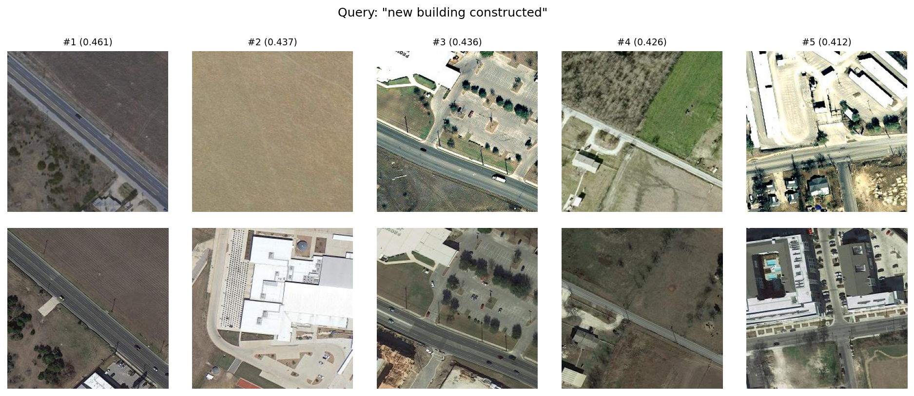
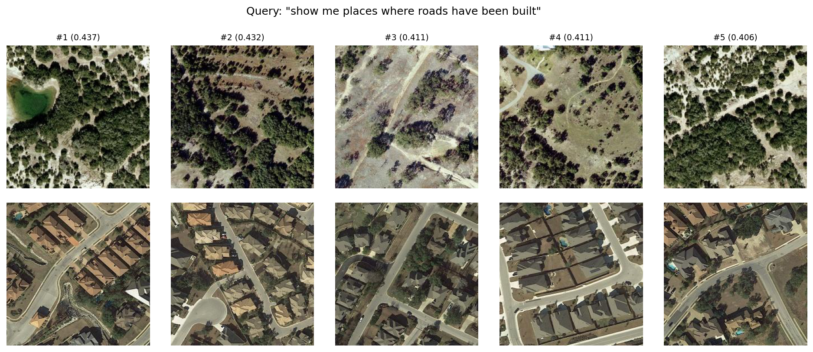

# Temporal Change Retrieval with Natural Language Queries

A deep learning system for retrieving temporal changes in satellite imagery using natural language descriptions. Built with RemoteCLIP encoders and contrastive learning.

## Publication Note

This repository is shared as a project preview while the associated paper is in preparation. The public code includes the retrieval pipeline, training setup, evaluation code, and baseline change encoders. One experimental temporal fusion module is kept as an interface only until publication. See [LICENSE](LICENSE) for usage terms.

## Problem Statement

Available change detection methods output binary masks or heatmaps, making it difficult to search for specific types of changes. This project enables semantic retrieval, given a text query like "new buildings constructed" or "deforestation in forested areas", the system retrieves matching temporal changes from a database of bi-temporal image pairs.


## Example Results

The model retrieves temporal satellite image pairs that match natural language change queries.

**Query:** new building constructed



**Query:** show me places where roads have changed



## Approach

### Architecture

The system uses a bi-temporal CLIP encoder that processes before and after images and outputs a change embedding that can be compared with text descriptions in a joint embedding space.

**Key Components:**
1. **CLIP Backbone**: Vision Transformer (ViT-B-32) pretrained on image-text pairs
2. **Change Encoding**: Multiple strategies to combine temporal information
3. **Contrastive Learning**: InfoNCE loss aligns change embeddings with text

### Change Encoding Strategies

We implement and compare 5 different strategies for encoding temporal changes:

1. **Difference**: Simple feature subtraction
   - Captures basic changes

2. **Concat**: Concatenate features with projection
   - Preserves directional information (before -> after)

3. **Learned**: MLP-based change encoder
   - Learns nonlinear change representations

4. **Cross-Attention**: Attention between timesteps
   - Attends to relevant regions across time
   - Captures spatial correspondences

5. **FST**: Experimental temporal fusion
   - Publication-pending strategy for temporal change representation
   - Public repository keeps the integration point, with implementation details omitted until paper release

### Training

- **Loss**: InfoNCE (contrastive loss for vision-language alignment)
- **Optimizer**: AdamW with learning rate 3e-5
- **Batch Size**: 512
- **Epochs**: 50-100
- **Fine-tuning**: Freeze early 8 transformer layers, train last 4

The model learns to maximize similarity between matching change-text pairs while minimizing similarity with non-matching pairs.

## Datasets

We train on multiple satellite change detection datasets to improve generalization:

**LEVIR-MCI** = 3,407 (Building changes with detailed captions)

**S2Looking** = 3,500 (Satellite imagery from multiple regions)

**WHU-CD** = 1,260 (Urban building changes)

**XBD** = 11,034 (Disaster damage assessment)

*Total* = ~15,000 (Multi-domain change detection)


## Installation

```bash
pip install -r requirements.txt
```

## Usage

### Training

Basic training with concat strategy:

```bash
python train.py \
  --hdf5-dir /path/to/hdf5/files \
  --caption-dir /path/to/captions \
  --strategy concat \
  --use-remote-clip \
  --freeze-early-layers \
  --batch-size 512 \
  --epochs 100 \
  --lr 3e-5 \
  --num-workers 4 \
  --device cuda \
  --output-dir checkpoints
```

**Strategy Options:**
- `--strategy difference` - Baseline
- `--strategy concat` - Best performance
- `--strategy learned` - Learnable change encoder
- `--strategy cross_attn` - Cross-attention
- `--strategy fst` - Experimental temporal fusion; implementation details omitted pending publication

**Model Options:**
- `--use-remote-clip` - Use RemoteCLIP (satellite-specific weights)
- `--freeze-early-layers` - Freeze first 8 transformer layers

### Evaluation

```bash
python evaluate.py \
  --checkpoint checkpoints/clip_concat_best.pt \
  --hdf5-dir /path/to/hdf5/files \
  --caption-dir /path/to/captions \
  --strategy concat \
  --device cuda
```

**Metrics:**
- **Recall@1**: Recall at rank 1 (top-1 accuracy)
- **Recall@5**: Recall at rank 5 (correct in top-5)
- **Recall@10**: Recall at rank 10 (correct in top-10)

## Results

Performance on multi-dataset evaluation (15K samples):

| Strategy | R@1 | R@5 | R@10 |
|----------|-----|-----|------|
| **Concat** | **12%** | **35%** | **48%** |


**Key Findings:**
- Concat strategy achieves best performance with freeze-early-layers
- RemoteCLIP improves results by ~5-7% over standard CLIP
- FST is included as a publication-pending strategy; implementation details are omitted until paper release

See [Example Results](#example-results) for qualitative retrieval examples.
